# SimpleLibrary-Rest Api

As we all know REST-API is,
A REST API (Representational State Transfer API) is a type of application programming interface (API) that adheres to the principles of REST architecture.

Uniform Interface: REST APIs use a uniform interface
typically HTTP
with standard methods like GET, POST, PUT, DELETE, etc.
to perform CRUD (Create, Read, Update, Delete) operations on resources.

## 2-tier Architecture
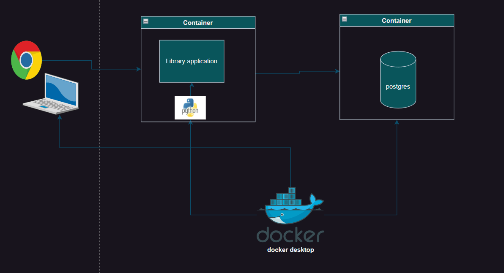

## requirements
This folder has all neccessary folders and modules, Taking inputs from the user and storing data in postgres database, Accessing data with the help of pre-defined packages

   * Sqlalchemy
   * FastAPI
   * Uvicorn
   * postgresql(database)
   * Docker desktop

It is better practice to create our fastapi application in "virtual environment", For this I created it by below command in terminal of my selcted root folder i.e "Library"
```bash
python -m venv venv
```
Then activated it
`.\venv\Scripts\Activate`

Then, I have installed neccessary modules for to create a REST-API applications using
FASTAPI framework in python
Need to install 'fastapi module',to install it type
```bash
pip install fastapi[standard]
```

Need to install server 'uvicorn module' to host,for installing this
```bash
pip install uvicorn
```
Now to interact our application with database, I had installed "sqlalchemy" by running below command
```bash
pip install SQLAlchemy
```
It is neccessary to save installed packages, Modules and Configuration files in one file for further process i.e For "Building images".so, I created a `requirements.txt` file
```bash
pip freeze > requirements.txt
```
With the help of installed pre-defined packages, I developed my own code which has modules with its own classes,functions and variables which defines a different functionalities which suits for my project described below 

## creating modules for library books items
**api**

This folder has a module **models.py** which has classes

`BookReq` -> Has attributes which helps in taking inputs from the user who is executing

`BookRes` -> Has attributes which will display all the inputs given by user on the browser in 'response body'   

**db**

This folder has two modules

**datbase.py** -> This module helps in creating connection with database
 
**models.py** -> This module has a class `Books` 

It will create table with the neccessary fields and values given by user i.e from api->models.py

It will create table with the name given and fileds with the attributes it has
   
**main.py**

This module has different functions

`create_book` -> This function helps in passing values which was taken from user and storing it in database i.e, "Books" table

`get_books` -> This function helps in returning the all books which were stored in Books table

`get_book` -> This function helps in returning the particular book which were stored in Books table using bookid field as an argument

`update_book` -> This function helps in updating the particular book using bookid filed as an argument

`delete_book` -> This function helps in deleting the particular book using bookid filed as an argument

After writing my own modules which has a functionalities i.e **CRUD** operations 

## Running the application
Now, I run the application by running below command successfully
```bash
uvicorn main:app --reload
```
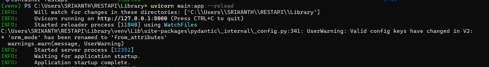

After successful application startup, I was able to see my application running on my machine i.e, localhost `127.0.0.1:8000/docs` as it runs on **8000** port as shown in below image

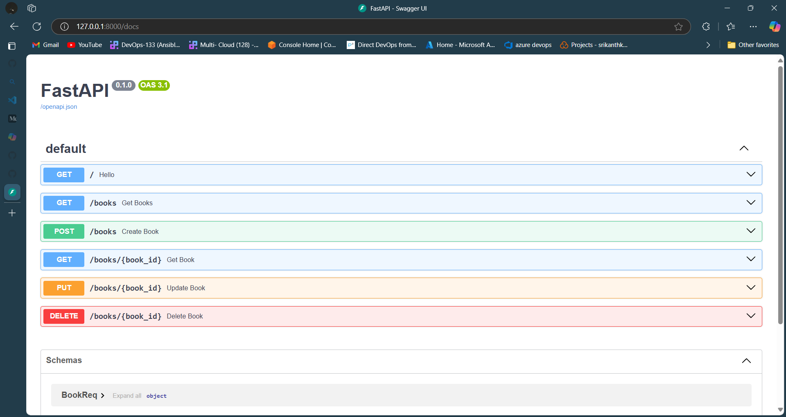

## setting up the datastorage
Now the problem with this is I can able to run this application successfully.But, It is not communicating with database, So for this i created a file `.env` which has an Environmental variable `DATABASE_URL` to speak with my database i.e, **Postgresql**

As I have an idea on how to create a docker image to run my application on containers.So, I created a `Dockerfile` which helps in creating a image with configuration files to start my application inside a container as a "PID1".

I have also an idea how to bring up the applications running on containers at one shot.So, For this purpose i had created a `docker-compose.yml` file which has 
  * postgres:15-alpine image with some environmental variables
  ```docker
  POSTGRES_USER: srikanth
  POSTGRES_PASSWORD: srikanthkovuri
  POSTGRES_DB: library
  ``` 
  * fast-api application image with database environmental variable
  ```docker
  DATABASE_URL=postgresql://srikanth:srikanthkovuri@db:5432/library
  ```
Now, I had brought up containers online in detached mode by following command
```bash
docker compose up -d
```
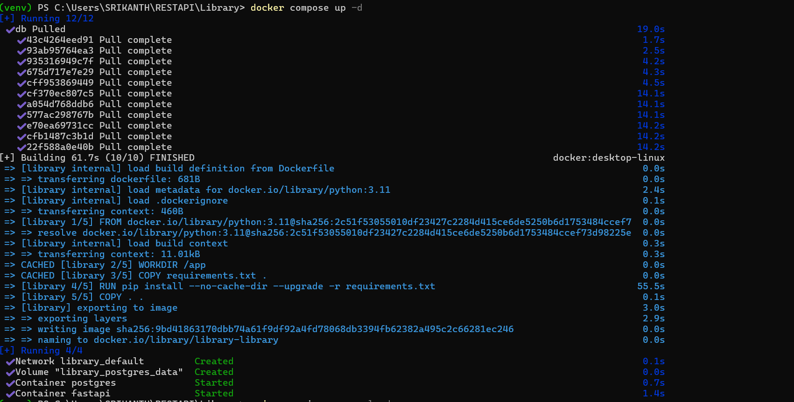

## application runtime
And the communication was established between these two containers and were able to communicate with each other as they are present over same network.Now, I run the application with `uvicorn main:app --reload` 

I was able to access my application which is hosting at "127.0.0.1:8000" by typing this on my browser `http://127.0.0.1:8000` 

Now I had performed some crud actions weather my application running successfully or not and is speaking with database or not.For this, I demonstarted this with url i typed on browser and responses i got with the help of images

Firstly, `http://127.0.0.1:8000/docs`


**To create a book**, `http://127.0.0.1:8000/books` method:post and clicked on try it

 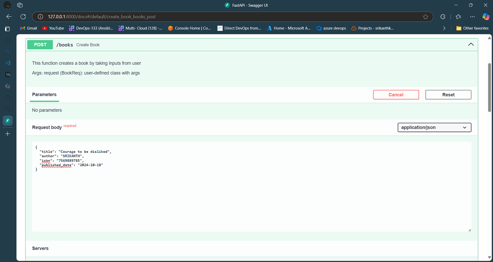

Then, clicked on Execute and got a response as like below

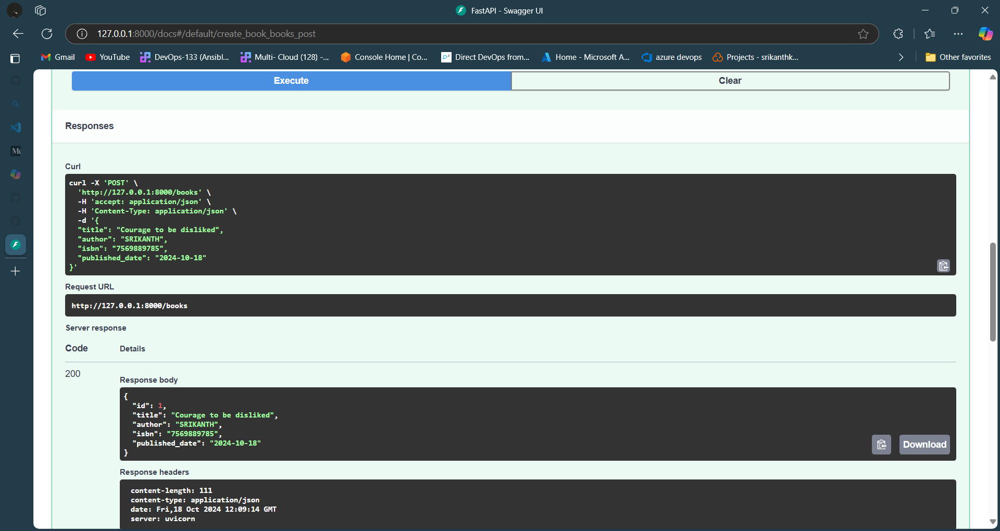

**To get books**, `http://127.0.0.1:8000/books` method:get and clicked on try it

 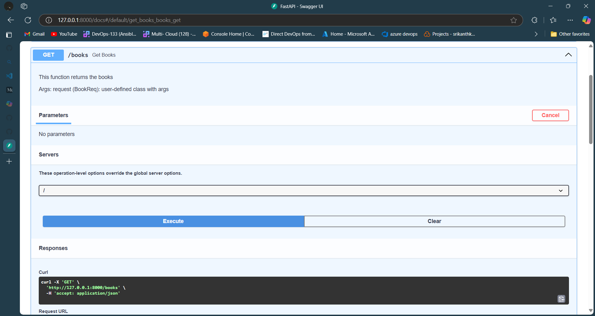

Then, clicked on Execute and got a response as like below

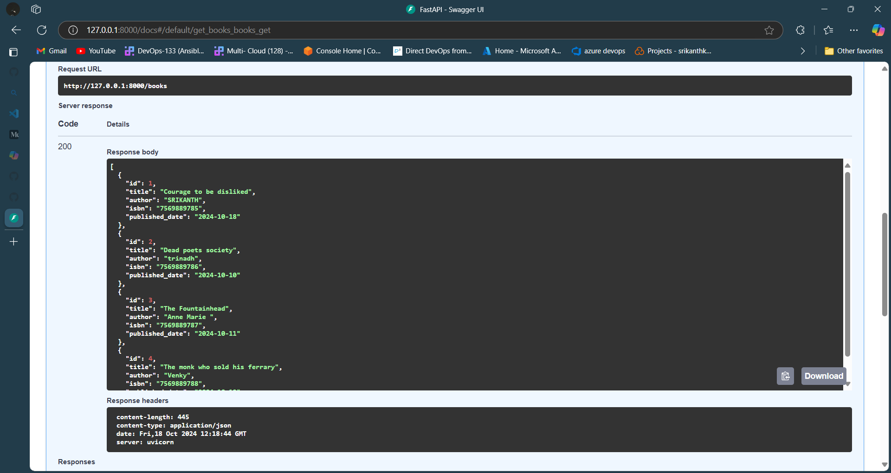

To see weather the postgres table is communicating with my application or not I had typed the below command
```bash
docker exec -it postgres psql -U srikanth -d library
```
was able to get the following response

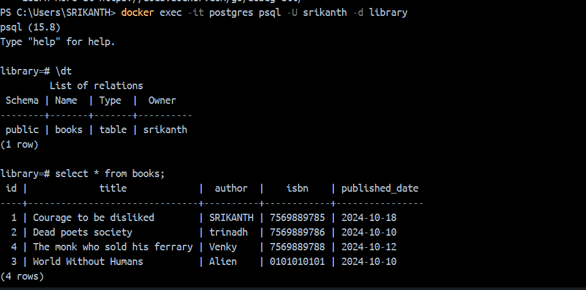

**To get a book**, `http://127.0.0.1:8000/books/2` method:get and clicked on try it

 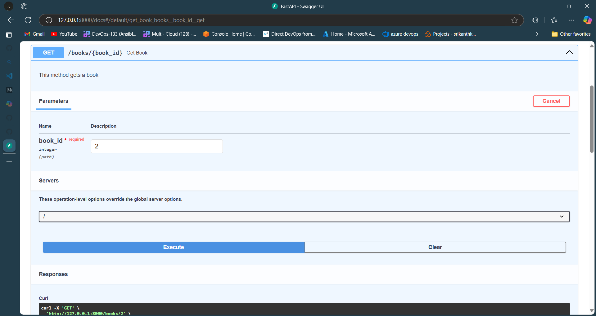

Then, clicked on Execute and got a response as like below

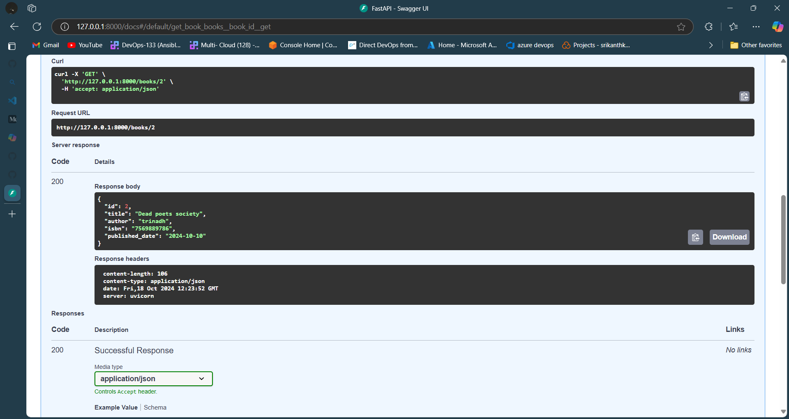

**To update a book**, `http://127.0.0.1:8000/books/3` method:put and clicked on try it

 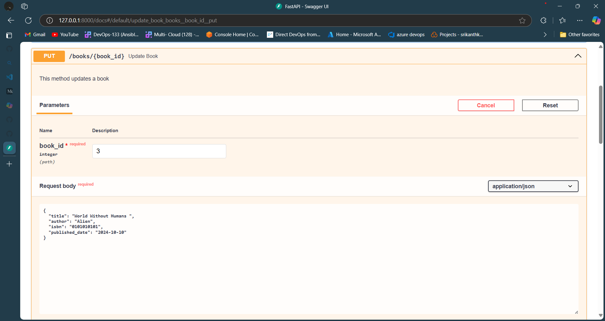

Then, clicked on Execute and got a response as like below

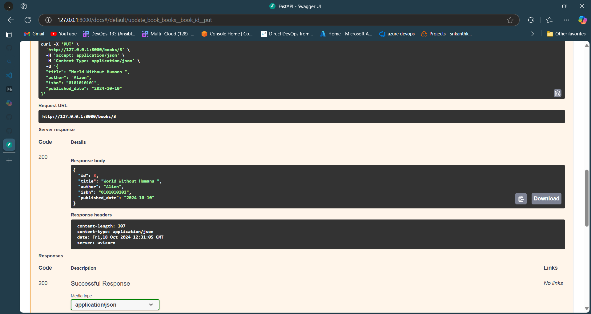

**To delete a book**, `http://127.0.0.1:8000/books/4` method:delete and clicked on try it

 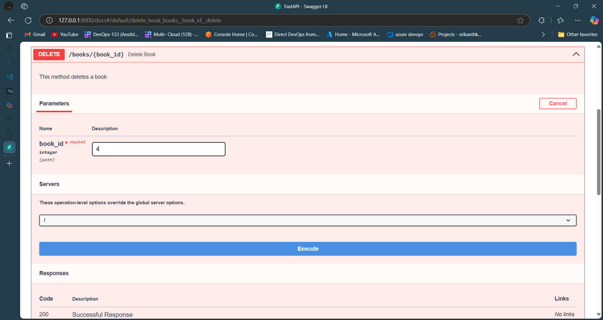

Then, clicked on Execute and got a response as like below

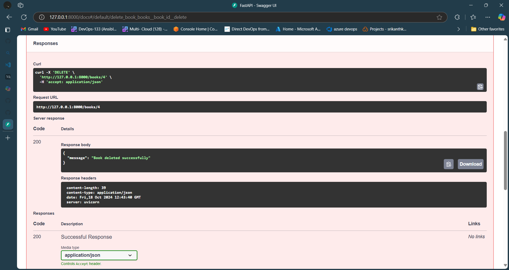

To see weather items deleted or not in postgres books table

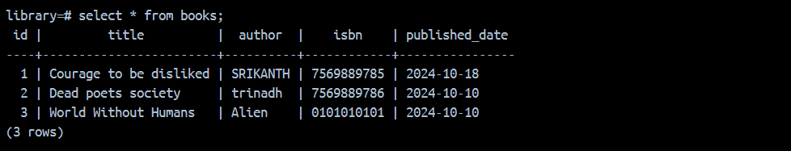 

After knowing that my application is running smoothly, my functions are working as per my requirement and also speaking with database.Then, I Brought down my containers by the following command
```bash
docker compose down
```
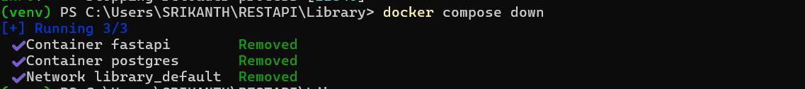

 


